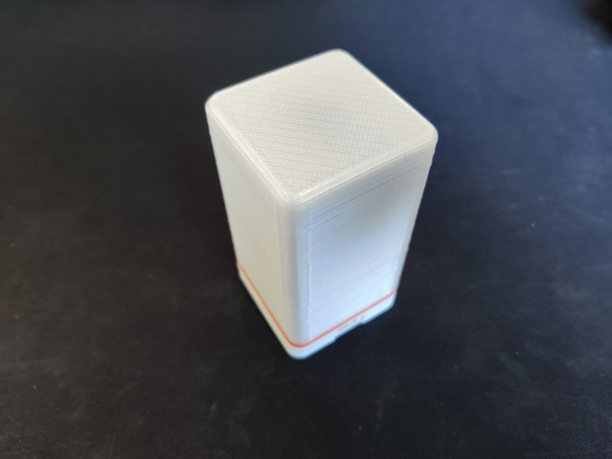
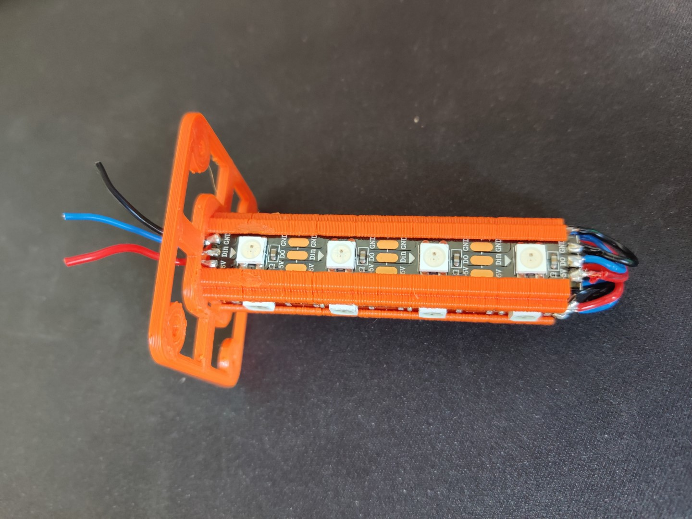
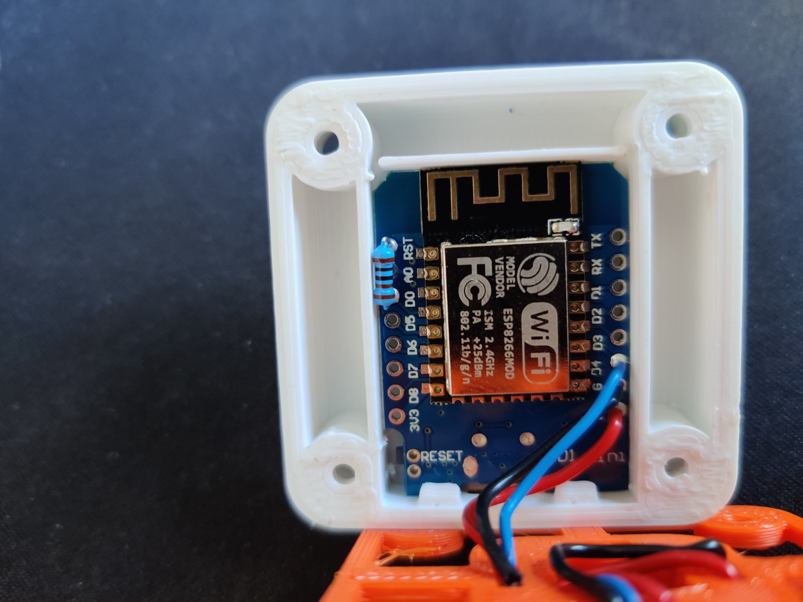
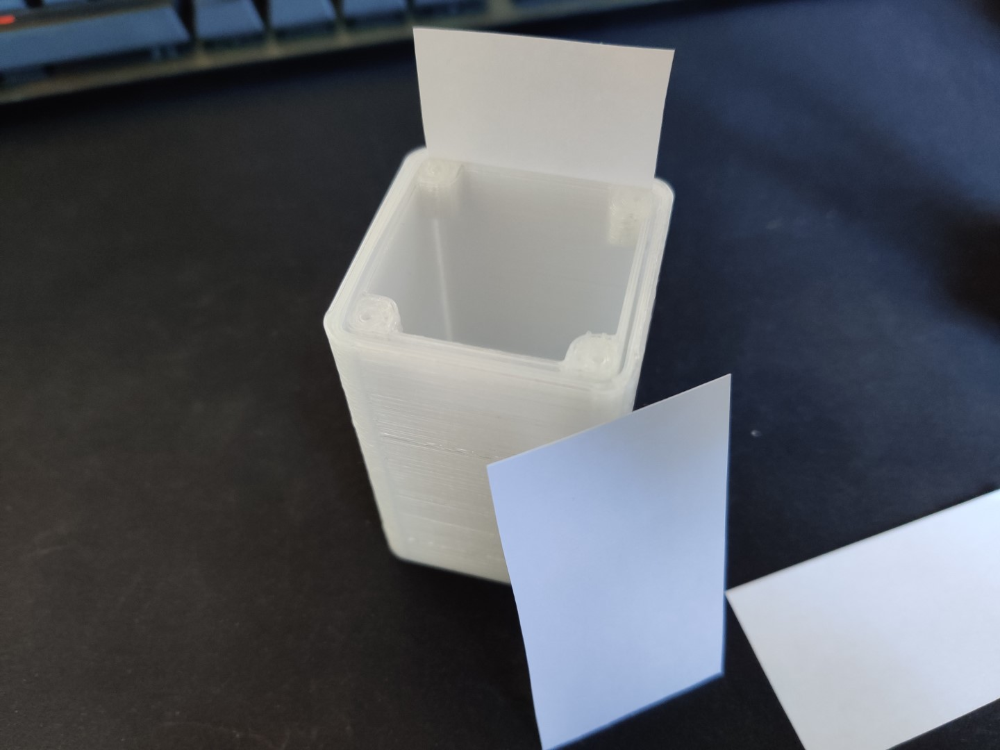

[](https://github.com/geaz/syncBlink/blob/main/LICENSE)   
[](https://ko-fi.com/A0A01MQZP)

# syncBlink Node
**syncBlink Node**s are devices which are able to connect to the *tcp server* provided by the **syncBlink Hub** or a closer available other *node* via WiFi. Because every *node* is also an access point and a tcp server it is possible to span a pretty big mesh of nodes.

This repository provides a simple example for a **syncBlink Node**. But it is possible to create other devices like for example wall mounted LED devices which will connect to the **syncBlink Hub** to create some nice color effects. Or desk lamp like devices. Just play with your imagination and come up with some cool devices. All you have to do is to take a *Wemos D1 Mini* connect some LEDs and flash the *node* firmware on it.



## BOM

- 3D Printed Parts
- Wemos D1 Mini
- 1x 330 Ohm Resistor
- [4x4 WS2812B LEDs (I used a strip and cut it)](https://www.amazon.de/dp/B01CDTED80)
- 4x M2x12mm screws
- Wire

## Firmware

To flash the firmware onto the Wemos connect it to your PC and press the *Upload* button in the status bar.


Each node also needs a flashed file system. Primarly to create a *config.json* which contains the configuration for the specific node. Just use the platformIO tasks **Build Filesystem Image** and **Upload Filesystem Image**. PlatformIO will flash the complete content of the *data* folder.

To get a node running the *config.json* needs at least the following content:

```
{
    "name": "Node",   // Initial name of the node (can be changed through the web app)
    "type": "node",   // The type name of the node. Can be used to distinguish nodes in the scripts.
    "led_count": 16,  // Amount of LEDs connected to the node
    "is_node": true   // A flag that tells the firmware, that it runs on a node
}
```

This is the list of all available config keys.

```
{
    "name": "Node",
    "type": "nodeType",
    "led_count": 9,
    "is_hub": false,
    "is_node": true,
    "is_analyzer": false,
    "has_display": false,
    "active_script": "Snake",
    "wifi_ssid": "WIFI",
    "wifi_pw": "PW"
}
```

## Build

Insert the four led strips into the *middle* part. And solder them together - **keep the direction of the data line in mind!**



Solder the LEDs to the *Wemos D1 Mini*. *VCC* to *5V*, *GND* to *GND* and *DataIn* to *D4*. Next, solder the 300Ohm resistor to the pins *RST* and *D0* and insert the *D1 Mini* into the *bottom* part.



Cut four pieces of paper and insert them into the slots of the *top* part.



Now place everything together and close it with the screws. You are done!

