   

# syncBlink Hub

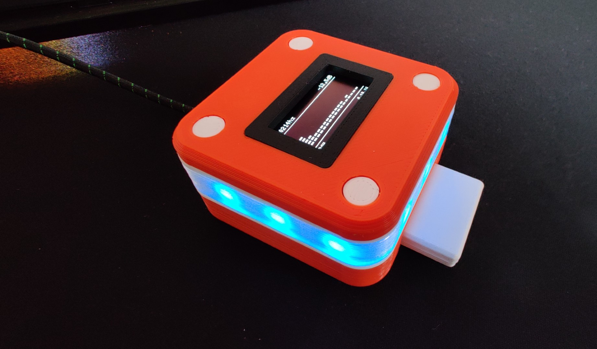

## Table of Contents
1. [🛥️ 3D Model](#-3d-model)
2. [📄 BOM](#-bom)  
3. [🚀 Firmware](#-firmware)  
4. [👷 Build](#-build)

### 🛥️ 3D Model
The models were designed in Fusion 360. The exported STLs are included in the Github repository (*stl* folder). Furthermore there are Fusion 360 archive files ready to download (*cad* folder).

### 📄 BOM

- 3D Printed Parts
- 1x Wemos D1 Mini
- 1x Capacitor 680uF
- 1x MAX4466
- [9x WS2812B LEDs (I used a strip and cut it)](https://www.amazon.de/dp/B01CDTED80)
- 4x M2x12mm screws
- 4x M3x4mm screws
- Wire
- Hotglue & Superglue

### 🚀 Firmware

Before building **syncBlink** you should flash the firmware onto the Wemos D1 Mini. This way you are able to make sure that it is functional. Open the project in [Visual Studio Code](https://code.visualstudio.com/). The project uses [PlatformIO](https://platformio.org/platformio-ide) to develop the firmware. Install the PlatformIO extension into Visual Studio Code, if not already done. 

To flash the firmware onto the Wemos connect it to your PC and press the *Upload* button in the status bar.

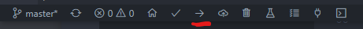

You also have to flash the file system to the Wemos.

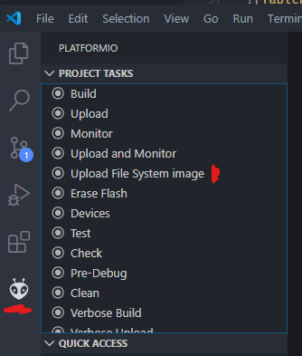

Afterwards start the *serial monitor* and you should see some outputs like in the screenshot below. If you are able to see the output, the device is working and you are ready to build the **syncBlink Hub**.

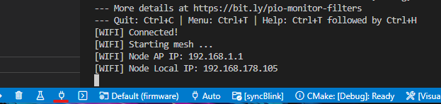

### 👷 Build

First of all, make yourself comfortable with the following schematics. It shows you all parts of the *Hub* which are necessary to connect to each other. We will use a piece of stripboard for each wire which is not directly connected to the Wemos D1 Mini. Mostly to provide power to each part.

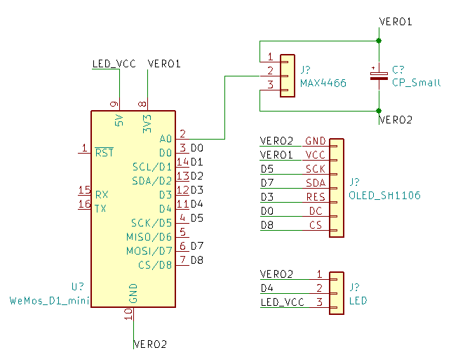

Now that you made yourself comfortable with the wiring, take the *Top* part and the *Frame* and glue them together with the superglue. I recommend to place something heavy on top to make sure that they bond well.

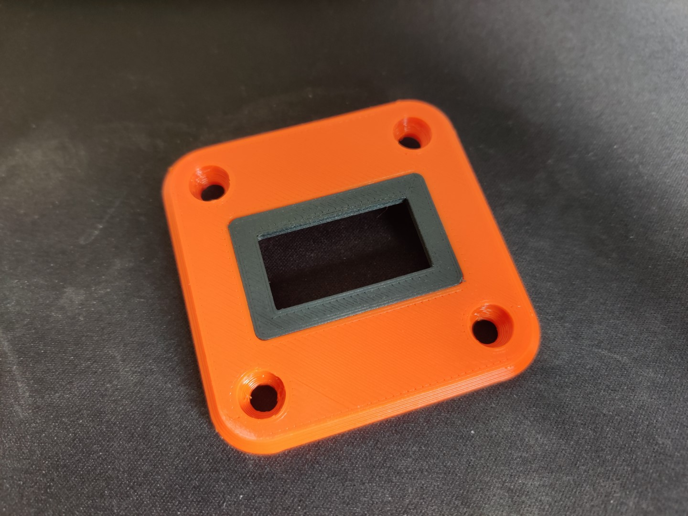

Solder wires to your display and mount it to the *Top* part.

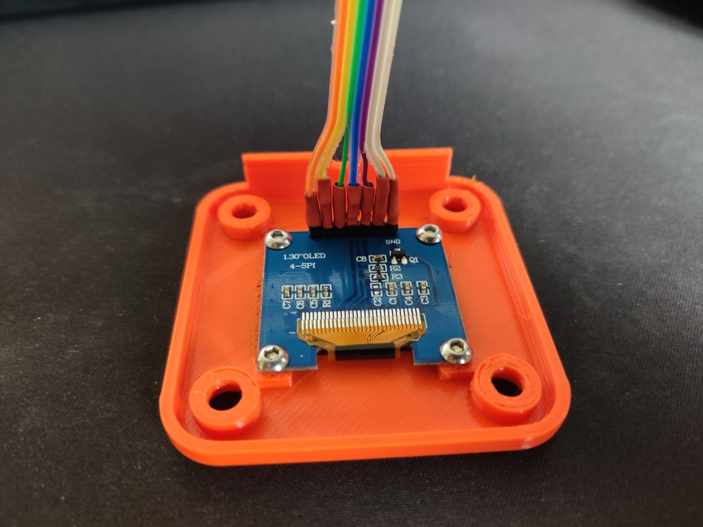

To diffuse the LEDs a bit, the *middle* part has a small slot for a paper insert. Take a bit of paper and cut it into a narrow stripe and insert it into the slot.

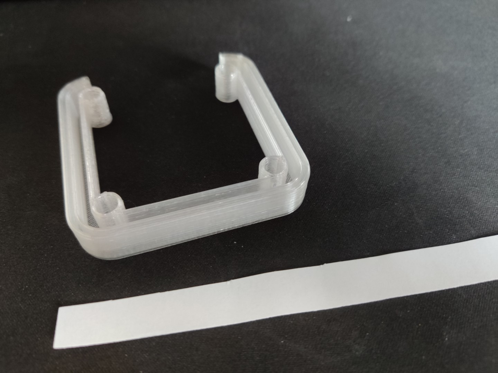

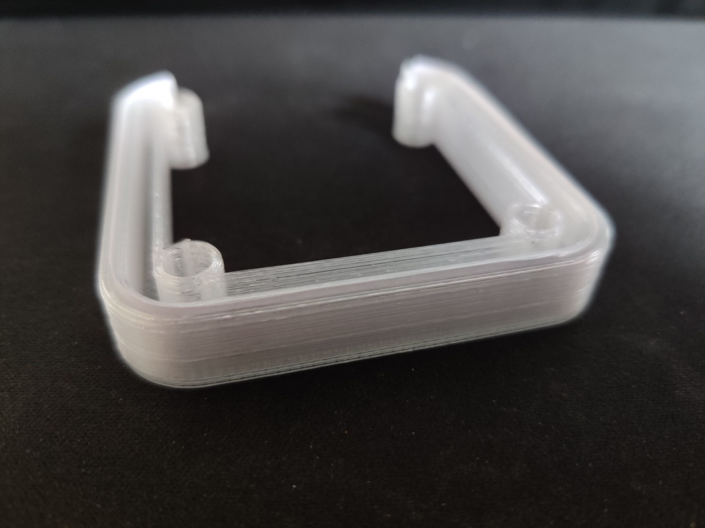

Solder three wires to your nine LED stripe and insert it into the *middle* part, too - **pay attention to the data line direction**. I bent the cables away from the back of the shell to avoid any possible interference between the microphone cables and the LEDs.

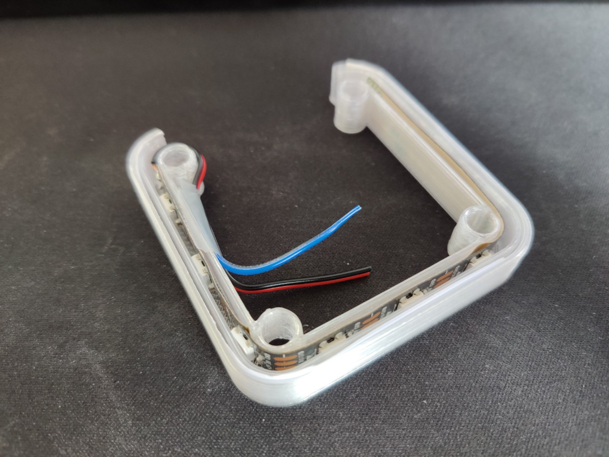

Solder three wires to your microphone and attach it with hotglue to the *Bottom* part of the shell.

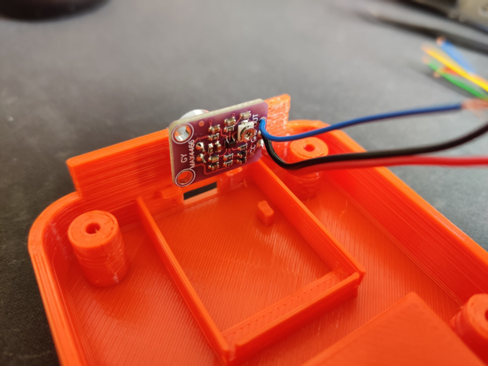

Create a 2x7 sized piece out of the stripboard. Picture below as a reference - pay attention to the copper line directions.  
Solder all necessary components and wires as shown in the verboard image below and the schematics above. The ground wires are only indicated (read the red comment) to keep the image tidy.

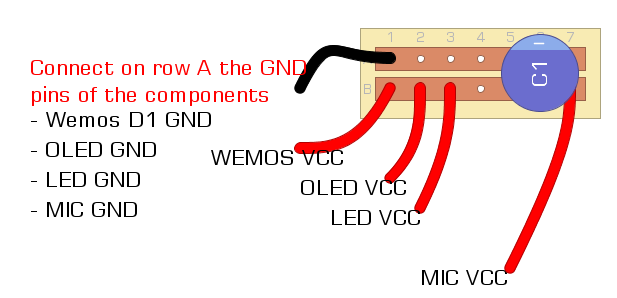

Mount the Wemos D1 Mini to the *Bottom* part of the shell.

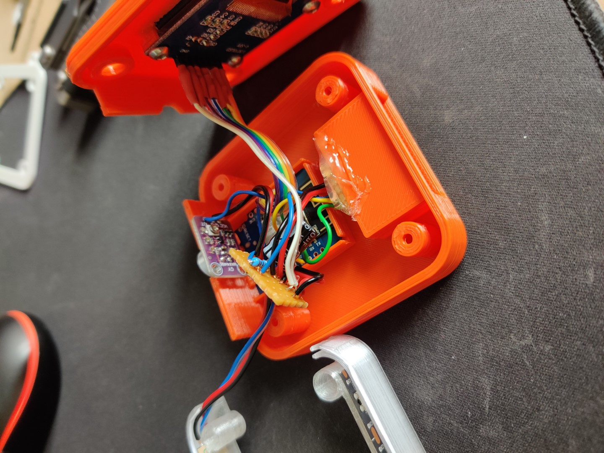

All components should be connected and you should be able to power the Wemos. You will see the *decibel* in the top right of the display. Set the gain of you microphone with a small screwdriver. It should float between -40 and -43dB in a silent room. If done, place the stripboard into the shell, place one of the *divider* parts on top of the *bottom* part, then place the *middle* part on top of it. Followed by an additional *divider* and the *top* part.
Insert the *bolts* into the four holes and use the M2x12mm screws to close the shell. Your **syncBlink Hub** is done!