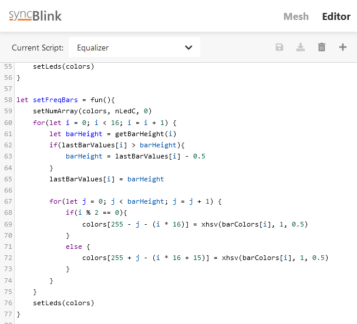

[](https://github.com/geaz/syncBlink/blob/main/LICENSE)   
[](https://ko-fi.com/A0A01MQZP)

# syncBlink
**syncBlink** is a lighting system that offers WiFi connectivity, programmability, and responsiveness to music. It enables users to create their own unique light patterns through customizable scripts. To facilitate this, the syncBlink Hub is equipped with a dedicated web application that allows users to write and control these scripts effectively.

In addition, the **syncBlink Hub** initiates a simple mesh network that includes a specialized TCP server. By connecting to this mesh network, **syncBlink Nodes** can establish an additional access point for other nodes to connect to. This means that even if certain nodes are out of range from the **syncBlink Hub**, they can still join the mesh network as long as at least one node is within range. These nodes have the ability to receive messages generated by the hub.

*Combining all these features, it becomes possible to create a synchronized mesh network of WiFi-connected devices that dynamically react to music.*

# 📖 Table of Contents
1. [🏠 syncBlink Hub](#🏠-syncBlink-Hub)
2. [🌲 syncBlink Node](#🌲-syncBlink-Node)
3. [🚀 Web Application](#🚀-web-application)
4. [🧑‍💻 blinkScript - syncBlink Script Language](#🧑‍💻-blinkScript)

## 🏠 syncBlink Hub

The hub is the central part of a **syncBlink** mesh. It provides a web application to manage the mesh and to create and edit **blinkScript**s.

Using the provided 3D models in the *stl* folder, designed in Fusion 360, you can easily bring your **syncBlink Hub** to life. The STL files in the repository make printing the necessary parts a snap. For customizations the Fusion 360 archives files are also provided in the *cad* folder.

The repository tries to provide a clear instruction to give a smooth assembly experience.
Flashing the firmware onto the used Wemos D1 Mini is made simple with using Visual Studio Code and PlatformIO.

Please head over to the **[syncBlink Hub](Station%20README.md)** readme for more information how to build and flash a hub device.

## 🌲 syncBlink Node

The **syncBlink Hub** is just the start. To create a larger mesh of lights it is necessary to build one, two or three nodes (or even more). **syncBlink Nodes** are able to connect to the **syncBlink** mesh to form a larger and wireless light system. The nodes are able to come in any size or form.

Please head over to the **[syncBlink Node](Node%20README.md)** readme for more information how to build and flash your first node device.

## 🚀 Web Application

The **syncBlink Hub** exposes a web application for mobiles and desktop.
Just connect to the access point with the following password:

```
SyncBlinkSaysLetThereBeLight!
```

By visiting the web application on **http://192.168.1.1** with a mobile browser the hub will serve a *setting* page where you are able to configure a WiFi network. The hub will connect to this network during the start procedure.


After the hub is connected to a network the hub IP will appear on the bottom right of the display. By visiting the hub web application with a desktop browser the hub serves an overview of the current **syncBlink Mesh**.


The graph provides functions to a varity of different functions. Like pinging nodes, switching the currently running scripts or changing the analyzer. Visit the *Editor* menu to change the content of the scripts on the hub or to create new ones.



**Info**
```
If you get random disconnections of your nodes after connecting your hub to a WiFi network,  
it is most probably because of an instable connection to the router. The problem is, that the  
ESP8266 just has one WiFi chip which is used to connect to the router AND serves as the access  
point for the nodes. If the hub looses the connection to the router, it can cause a disconnection  
of the access point clients.
```

## 🧑‍💻 blinkScript

**blinkScript** is a custom script language for **syncBlink**. The scripts get compiled by the web application and are stored in a byte code format on the **syncBlink Hub**. On selection the compiled script gets distributed in the mesh and gets execute by the integrated virtual machine on each node.

To make the script language possible on the esp8266 it has a few limitations which shouldn't affect to many scripts (like a limit of 256 objects per script).

The script language is pretty basic and comes with the following features:

- Functions
- Variables
- Conditionals (if/else - NO else if)
- for/while loops
- Arrays
- Closures
- Some build in functions and variables

### Available global variables

- **maxF** *The maximum frequency which is recognizable by syncBlink*
- **nLedC** *The LED count of the current node*
- **mLedC** *The LED count of the whole mesh*
- **pLedC** *The LED count of the current route position*
- **pNodeC** *The node count of the current route position*
- **lVol** *The last analyzed volume in percentage (0-100)*
- **lFreq** *The last analyzed frequency*
- **vol** *The current analyzed volume in percentage (0-100)*
- **freq** *The current analyzed frequency*
- **name** *The name of the current node (initialy specified by the flashed config.json)*
- **type** *The type name of the current node (specified by the flashed config.json)* 
- **freqBin** *An array holding 48 bins of the FFT analysis (power of the different frequencies). The bin resolution is round about 100mHz*       

### Available global functions

- **println(message: string)** *Prints the message to the serial output*
- **setNumArray(array: Array<number>, size: number, value: number)** *Function to quickly fill a numeric array of the given size with the given value. Helpful to reset or initialize an array*
- **setGroups(countPerGroup: number)** *Set the LEDs of the current node to groups of the provided size. For example, if the node has 16 LEDs and setGroups(4) is called, the node will handle the 16 LEDs like four LEDs, where always four LEDs will be grouped together as one.*
- **setLinearGroups(countPerGroup: number)** *Same as above, but the internal numbering of the LEDs will be sequential. Resulting in a different group pattern.*
- **clearGroups()** *Clears all defined groups.*
- **setDelay(analyzerCount: number)** *Delays the analyzer results by the given amount of updates.*
- **getLed(led: number)** *Gets the color (Hex RGB) of the given LED.*
- **setLeds(colors: Array<number>)** *Set LEDs by defining an array of Hex colors.*
- **setAllLeds(color: number)** *Sets all LEDs to the given color (Hex RGB).*
- **map(value: number, inMin: number, inMax: number, outMin: number, outMax: number)** *Maps the value within the range of inMin and inMax to the new range defined by outMin and outMax.*
- **xrgb(r: number, g: number, b: number)** *Converts the given RGB color to a hex number representation.*
- **xhsv(h: number, s: number, v: number)** *Converts the given HSV color to a hex number representation.*

### Minimal example script

Each script has to define two functions as given in the following example.

```
let update = fun(delta) {
    // This function gets executed on each analyzer result (loop)
    // 'delta' contains the milliseconds since the last call of the loop
}

let init = fun(){
    // this function gets executed ONCE at start of the script
}
```

The **syncBlink Hub** comes with some example scripts. Also available [here](src/firmware/data/scripts/).